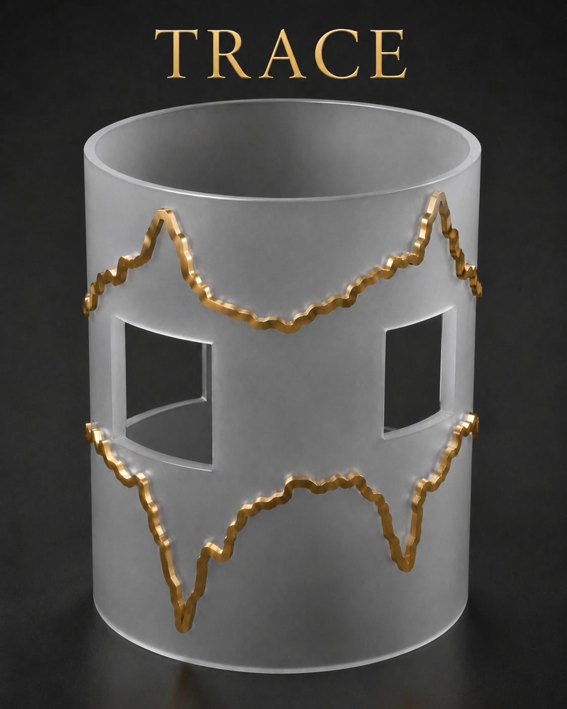

 

# TRACE coil design 

The Project is a community-based tool for the generation of coil Layouts within the MRI/NMR environment.
TRACE (Trajectory Reinforcement for Additive Coil dEsign) uses a PyTorch actor-critic policy to construct connected, finite-width gradient-coil layouts. 
The policy is trained using electromagnetic rewards from a surface current-continuity finite-element model and Biot-Savart field evaluation.


## Installation

Python 3.10 or newer is recommended.

```bash
python -m venv .venv
python -m pip install --upgrade pip
python -m pip install -r requirements.txt
```

For GPU training, install the PyTorch build appropriate for the local CUDA version. Use `--device cpu` when CUDA is unavailable.

<!-- GETTING STARTED -->

### Algorithm overview


## Train gradient coils

The following command trains separate policies for the x-, y-, and z-gradient
coils using the manuscript configuration (128 x 80 grid and 10,000 episodes per
axis):

```bash
python trace_train.py --axes xyz --episodes 10000 --device cuda:0 --run-tag baseline
```

To train only selected axes, set `--axes` to `x`, `y`, `z`, `xz`, or another
combination. Training checkpoints and records are written to `outputs/trace/`:

- `.pt`: policy checkpoint used for inference;
- `.pkl`: training history, retained topology, and terminal performance.

## Infer a coil layout

Run stochastic inference from a trained checkpoint:

```bash
python trace_infer.py --checkpoint outputs/trace/x_seqto_torch_baseline_128x80_nep.pt --axis x --samples 64 --device cuda:0 --output outputs/x_best64.npz
```

Replace the example checkpoint name with the `.pt` file produced during
training. For one deterministic greedy rollout, use:

```bash
python trace_infer.py --checkpoint outputs/trace/x_seqto_torch_baseline_128x80_nep.pt --axis x --deterministic --device cuda:0
```

## Evaluate performance

Every inferred candidate is verified by the FEM/Biot--Savart forward model. The inference command reports:

- maximum field error (`field_error_percent`);
- resistance (`resistance_ohm`);
- power dissipation (`power_W`);
- path length (`steps`);
- rollout and terminal-verification time (`elapsed_s`).

Best-of-k inference retains the valid connected candidate with the lowest field error. 
When `--output` is specified, the selected binary layout are saved in a compressed `.npz` file.


<!-- LICENSE -->
## License

 See `LICENSE.txt` for more information.


 <!-- CONTACT -->
## Contact


Project Link: [https://github.com/luohongyan/TRACE-coil-design ]
